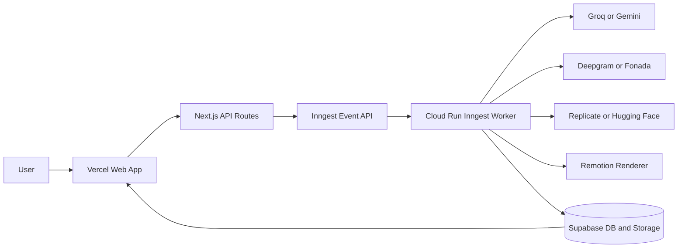
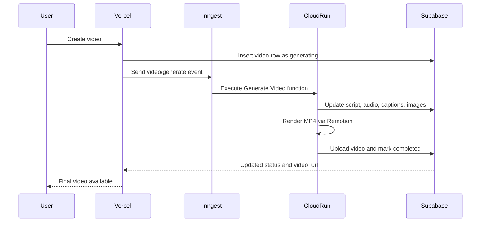

# VidGen

AI-powered short-form video generation platform for automated reel production and publishing.

VidGen helps creators generate complete short videos from a niche/topic input. It orchestrates script writing, voice generation, captions, image generation, rendering, storage, and publish workflows through an event-driven architecture.

## Why This Project Matters

- Demonstrates production-grade async orchestration with retry/failure handling
- Separates web traffic from heavy background rendering for reliability
- Integrates multiple AI providers in one deterministic pipeline
- Ships with deployable cloud architecture on Vercel + Google Cloud Run

## Core Capabilities

- Topic to script generation with structured multi-scene output
- Scene-level TTS generation and asset upload
- Auto-caption generation and scene word timings
- AI image generation per scene
- MP4 rendering with Remotion
- Persistent state tracking in Supabase
- Scheduled and event-driven workflows via Inngest

## System Architecture



## Production Execution Model



## Tech Stack

- Frontend and API: Next.js, React, TypeScript
- Auth: Clerk
- Orchestration: Inngest
- Background compute: Google Cloud Run
- Data and files: Supabase Postgres + Supabase Storage
- AI providers: Groq, Gemini, Deepgram, Fonada, Replicate, Hugging Face
- Video rendering: Remotion

## Repository Structure

- app: Next.js app routes and UI
- api: API route groups for data and integrations
- inngest/functions: Inngest workflow functions
- inngest/worker: Express worker host for Cloud Run
- remotion/src: Video composition source
- lib: Shared clients and provider adapters

## Local Development

Prerequisites:

- Node.js 20+
- npm
- Supabase project
- Inngest account

Run web app:

```bash
npm run dev
```

Run worker locally:

```bash
npm run worker:dev
```

## Environment Variables

Create a local environment file with your own keys. Typical required variables include:

- NEXT_PUBLIC_SUPABASE_URL
- NEXT_PUBLIC_SUPABASE_ANON_KEY
- SUPABASE_SERVICE_ROLE_KEY
- CLERK_SECRET_KEY
- NEXT_PUBLIC_CLERK_PUBLISHABLE_KEY
- GROQ_API_KEY
- GEMINI_API_KEY
- DEEPGRAM_API_KEY
- REPLICATE_API_TOKEN
- RESEND_API_KEY
- INNGEST_EVENT_KEY
- INNGEST_SIGNING_KEY

Never commit real secrets to git history.

## Deployment

### 1) Deploy web tier

- Deploy Next.js app to Vercel
- Configure production environment variables in Vercel settings

### 2) Deploy worker tier

Build worker image:

```bash
gcloud builds submit --config cloudbuild.worker.yaml --project YOUR_GCP_PROJECT
```

Deploy Cloud Run worker:

```bash
gcloud run deploy vidgen-worker \
	--image gcr.io/YOUR_GCP_PROJECT/vidgen-worker \
	--platform managed \
	--region YOUR_REGION \
	--allow-unauthenticated \
	--memory 4Gi \
	--cpu 2 \
	--timeout 3600 \
	--concurrency 1 \
	--env-vars-file cloudrun.env.yaml
```

### 3) Configure Inngest

Use Cloud Run endpoint as the production sync and execution endpoint:

- https://YOUR_CLOUD_RUN_HOST/api/inngest

Do not keep Vercel Inngest endpoint active in production.

## Reliability and Failure Handling

- Queue dispatch failures are surfaced and persisted to video error fields
- Workflow onFailure handler marks jobs failed with reason
- Background rendering runs outside web request lifecycle
- Video row is updated progressively across pipeline stages

## Resume Highlights

You can describe this project with impact-focused bullets such as:

- Built an event-driven AI video generation platform using Next.js, Inngest, and Cloud Run
- Designed a distributed worker architecture separating user traffic from CPU-intensive rendering
- Implemented end-to-end media pipeline: script, TTS, captions, image generation, and MP4 rendering
- Integrated Supabase persistence and storage with production status tracking and failure recovery

## Security Notes

- Keep API keys only in secret managers and deployment environments
- Avoid committing generated environment manifests with real values
- Rotate credentials immediately if a secret is ever exposed

## License

Use your preferred license for open-source publication, or keep private for portfolio/resume usage.
